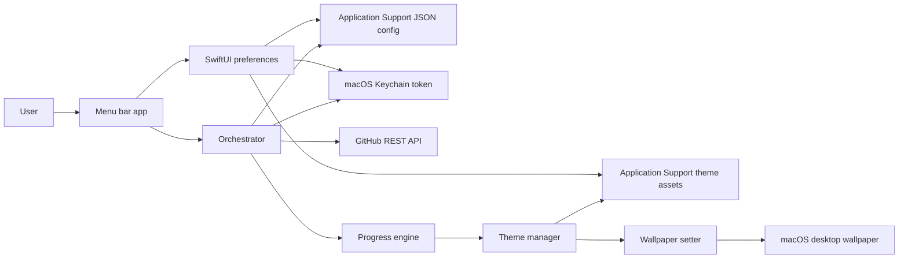

# Architecture

GrowthWallpaper is a native macOS menu bar app that turns GitHub issue completion into a living desktop wallpaper. The project is intentionally local-first: there is no hosted backend, no account system, no telemetry, and no server-side persistence. The app runs on the user's Mac, reads progress from GitHub's REST API, maps that progress onto a theme frame, and applies the selected image as the macOS desktop wallpaper.

This document is written to highlight the engineering decisions behind the MVP, especially the parts that matter when evaluating product judgment, system design, security, and native app implementation.

## System Overview

At runtime, `MenuBarController` owns the app's menu bar surface and starts the `Orchestrator`. The orchestrator loads local configuration, reads the GitHub token from Keychain, polls GitHub for closed issues with the configured label, computes the current progress frame, validates that the selected theme can provide that frame, and asks AppKit to apply the wallpaper across available screens.

## Frontend

The frontend is a native macOS interface built with SwiftUI and AppKit:

- `PreferencesView` is a SwiftUI settings form for repository configuration, issue label, token entry, growth steps, reset cadence, polling interval, theme selection, theme import, and launch-at-login.
- `MenuBarController` uses AppKit's `NSStatusBar` and `NSMenu` APIs to provide a lightweight always-available menu bar experience.
- `PreferencesWindowController` keeps preferences accessible from the menu bar without forcing a traditional document-style app window.
- `WallpaperSetter` uses `NSWorkspace` and `NSScreen` to apply the selected wallpaper image to every connected display.
- `LaunchAtLoginManager` uses `ServiceManagement` and `SMAppService` for macOS 13+ launch-at-login support.

The UI is intentionally small because the app's core interaction model is ambient. Users configure it once, then the menu bar status and wallpaper become the feedback loop.

## Backend

There is no custom backend. This is a deliberate architectural choice.

Instead of introducing server infrastructure, GrowthWallpaper uses GitHub as the source of truth for progress. `GitHubClient` calls GitHub's REST API directly from the Mac app and requests closed issues for the configured repository and label. The app then filters issues by the current cycle start date.

This removes several operational and privacy concerns:

- No server to deploy, monitor, scale, or secure.
- No app-owned database containing user repository metadata or tokens.
- No account system or session management.
- No telemetry pipeline.
- Fewer compliance concerns because sensitive data stays on the user's machine.

The tradeoff is that each client polls GitHub independently and must handle API failures locally. The orchestrator maps common failure modes into user-facing status text, including invalid tokens, missing repositories, rate limits, and generic HTTP errors.

## Database And Local Persistence

GrowthWallpaper does not use a traditional database. It uses local files and Keychain storage, each chosen for the sensitivity and shape of the data:

- `ConfigStore` persists non-secret app settings as JSON in `~/Library/Application Support/GrowthWallpaper/config.json`.
- `ConfigStore` also stores cycle state in `cycle.json`, including the current cycle start and the last applied image index.
- `KeychainStore` stores the GitHub personal access token in macOS Keychain as a generic password item.
- `ThemeManager` and `ThemeInstaller` store imported theme assets under `~/Library/Application Support/GrowthWallpaper/Themes`.

The JSON persistence layer keeps the MVP understandable and easy to inspect while still using atomic writes for config and cycle updates. A heavier embedded database would add complexity without much benefit for the current data model.

## Auth And Security

GrowthWallpaper does not implement its own authentication system. Users provide a GitHub personal access token, ideally a fine-grained token limited to the single repository being tracked.

Security-relevant decisions:

- Tokens are stored in macOS Keychain, not in JSON config.
- The token is only sent to `api.github.com` as a bearer token.
- The app only needs read access to issue metadata.
- There is no backend service that can collect, proxy, or leak tokens.
- There is no analytics or telemetry path.

This design keeps the trust boundary small. The user's Mac and GitHub are the only systems that need access to the token.

## Progress Engine

`ProgressEngine` converts completed issue count into a bounded progress snapshot:

- Completed issues are capped by the configured goal.
- Progress ratio is derived from completed issues divided by total steps.
- The ratio is mapped to an image frame index.

`CycleManager` defines the reset boundary. A cycle can reset daily or weekly, and the orchestrator compares the current cycle start against persisted cycle state. When a new cycle begins, it resets the last applied image index so the wallpaper can move through the theme again.

The core loop is intentionally deterministic:

1. Load config and token.
2. Determine the current cycle start.
3. Fetch closed GitHub issues for the repo and label.
4. Filter by cycle start.
5. Compute progress.
6. Resolve the selected theme frame.
7. Apply the wallpaper if the frame changed or has not been applied in this session.

## Theme System

Themes are externalized as folders or ZIP files so the app can grow visually without changing Swift code.

Each theme contains:

- A `theme.json` manifest.
- A stable theme id that must match the folder name.
- A display name.
- A frame count between 4 and 10.
- A frame filename pattern, defaulting to `frame_%02d`.
- PNG or JPG frame files.

`ThemeValidator` validates imported themes before installation. `ThemeInstaller` supports folders and ZIP archives, resolves common packaging layouts, installs themes into Application Support, and reloads the available theme list. `ThemeManager` scans installed themes and rejects incomplete or invalid packages.

This separation gives the project a clean extension point: new visual systems can be distributed as assets instead of app releases.

## AI Integration

There is no AI integration in the current app.

The project is designed so AI could be added later without disrupting the core architecture. Plausible extensions include:

- Generating custom theme frames from a user prompt.
- Summarizing completed GitHub issues into a weekly progress note.
- Suggesting theme concepts based on a repository's domain.

The current MVP avoids AI because the product's main value can be delivered with deterministic local logic and GitHub issue data. That keeps costs, latency, and privacy risk low.

## Deployment

The app is currently an early unsigned macOS MVP distributed as a zipped `.app`, with installation instructions in the README. Users unzip the app, move it to Applications, and approve the app manually if macOS Gatekeeper blocks first launch.

Current deployment characteristics:

- Native Xcode project under `GrowthWallpaper/GrowthWallpaper.xcodeproj`.
- No hosted backend deployment.
- No database migrations.
- No production secrets.
- No auto-update channel yet.
- No code signing or notarization yet.

Future production hardening would likely include Developer ID signing, notarization, a release pipeline, automatic update support, and clearer versioning around theme compatibility.

## Reliability And Failure Handling

The app handles several important edge cases locally:

- Polling is scheduled with a background `DispatchSourceTimer`.
- Manual refresh is rate-limited with a short cooldown.
- Concurrent refreshes are guarded to avoid overlapping GitHub requests.
- A pending manual refresh can be replayed after the current refresh finishes.
- GitHub errors are mapped to concise user-facing menu bar status messages.
- Missing themes or missing frames are surfaced instead of failing silently.
- Wallpaper application errors are reported separately from GitHub errors.

These choices keep the app understandable while protecting the user from confusing no-op behavior.

## Engineering Tradeoffs

The architecture favors a small native client over a multi-service system. That is the right fit for an ambient desktop utility, but it comes with explicit tradeoffs.

Advantages:

- Strong privacy story.
- Minimal operational burden.
- Low infrastructure cost.
- Small trust boundary.
- Easy local debugging.
- Native macOS integration.
- Asset-based theme extensibility.

Tradeoffs:

- GitHub polling happens independently on each installed client.
- Progress is limited by GitHub API behavior and rate limits.
- Without a backend, there is no cross-device sync.
- Without signing and notarization, installation friction is higher.
- The current persistence model is simple and local, not designed for multi-user or cloud workflows.

## Code Map

- `GrowthWallpaper/GrowthWallpaper/App/GrowthWallpaperApp.swift`: SwiftUI app entry point.
- `GrowthWallpaper/GrowthWallpaper/App/AppDelegate.swift`: bootstraps themes and menu bar controller.
- `GrowthWallpaper/GrowthWallpaper/App/MenuBarController.swift`: menu bar UI and app commands.
- `GrowthWallpaper/GrowthWallpaper/UI/PreferencesView.swift`: settings UI and theme import entry point.
- `GrowthWallpaper/GrowthWallpaper/Core/Orchestrator.swift`: main polling and wallpaper update workflow.
- `GrowthWallpaper/GrowthWallpaper/Core/GithubClient.swift`: GitHub REST API client and error mapping.
- `GrowthWallpaper/GrowthWallpaper/Core/ProgressEngine.swift`: issue count to progress frame mapping.
- `GrowthWallpaper/GrowthWallpaper/Core/CycleManager.swift`: daily and weekly reset calculations.
- `GrowthWallpaper/GrowthWallpaper/Core/ConfigStore.swift`: local JSON config and cycle persistence.
- `GrowthWallpaper/GrowthWallpaper/Core/KeychainStore.swift`: secure token persistence.
- `GrowthWallpaper/GrowthWallpaper/Core/ThemeManager.swift`: installed theme discovery and frame lookup.
- `GrowthWallpaper/GrowthWallpaper/Core/ThemeInstaller.swift`: theme folder and ZIP import.
- `GrowthWallpaper/GrowthWallpaper/Core/ThemeValidator.swift`: theme manifest and asset validation.
- `GrowthWallpaper/GrowthWallpaper/Core/WallpaperSetter.swift`: multi-screen wallpaper application.

## Interview-Ready Summary

GrowthWallpaper is a local-first native macOS app with a small but intentional architecture: SwiftUI and AppKit for the desktop experience, GitHub REST as the external progress source, Keychain for secret storage, JSON files for inspectable local state, and an asset-based theme system for extensibility. The system avoids backend complexity because the product does not need accounts, shared state, or server-side computation. The strongest engineering decisions are the privacy-preserving trust boundary, deterministic progress pipeline, explicit failure handling, and clean separation between app configuration, external API access, progress calculation, theme validation, and OS-level wallpaper integration.
