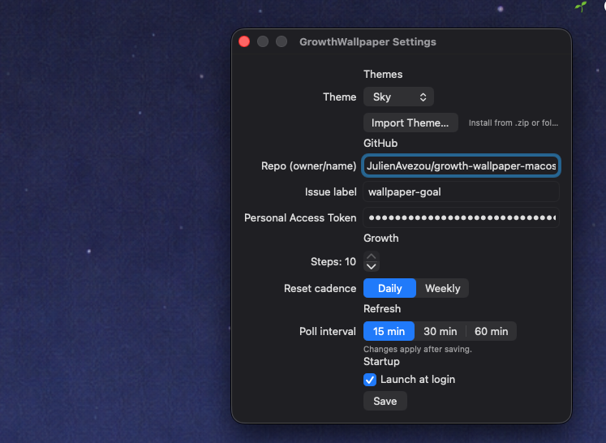
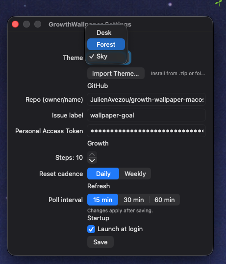

# GrowthWallpaper 🌱

A macOS menu bar app that turns your **GitHub progress into a living wallpaper**.

Close issues → your wallpaper grows.
No accounts. No backend. No tracking.

---

## What is GrowthWallpaper?

GrowthWallpaper is a lightweight macOS app that visually represents progress toward a goal using your desktop wallpaper.

You connect it to a GitHub repository, choose a theme, and define a goal (number of issues).
As issues are closed, the wallpaper evolves through a sequence of images.

Think:

- 🌲 a forest slowly growing
- 🏛 a structure being built
- 🌅 a scene becoming richer over time

---

## Key Features

- 🌱 **Progress-based wallpapers** (not time-based)
- 🧠 **Uses GitHub issues** as the progress signal
- 🖥 **Native macOS menu bar app**
- 🔐 **GitHub token stored in Keychain**
- 🚫 **No backend, no telemetry, no accounts**
- 🎨 **Import custom themes** (folders or ZIPs)
- ⚙️ **Configurable steps & reset cadence**

---

## How It Works

1. You define a goal (e.g. 6 issues)
2. You close GitHub issues with a specific label
3. Each completed step advances the wallpaper
4. At the end of the cycle (daily / weekly), it resets

The app polls GitHub periodically (default: every 15–60 minutes).

---

## Installation (MVP)

> ⚠️ The app is currently unsigned (early MVP).

1. Download the latest `.zip` from **GitHub Releases**
2. Unzip `GrowthWallpaper.app`
3. Move it to your **Applications** folder
4. Open it
5. If macOS blocks it:
   - Right-click → **Open**
   - Or go to **System Settings → Privacy & Security → Open Anyway**

The 🌱 icon will appear in your menu bar.

---

## Setup

Open **Preferences** from the menu bar:

- **GitHub Repo**: `owner/repo`
- **Issue label**: e.g. `wallpaper-goal`
- **Personal Access Token (PAT)** (read-only)
- **Total steps**: 4–10
- **Reset cadence**: Daily or Weekly
- **Poll interval**: 15–60 minutes
- **Theme**: select or import one

Click **Save**.

⚠️ For the PAT, please use the smallest scope needed and suggest using fine-grained PAT limited to a single repo if possible

---

## Themes 🎨

Themes define how progress looks visually.

You can:

- Import a theme folder
- Import a `.zip`
- Create your own themes

Example themes are included in Releases:
Download a theme ZIP from Releases (forest, sky, desk) → Preferences → Import Theme… → Select the ZIP

See [`THEMES.md`](./THEMES.md) for full details.

---

## Screenshots & Demo

https://github.com/user-attachments/assets/fda73ff0-9537-437e-8f9e-541d516437e1

---

## Privacy & Security

- GitHub token is stored in **macOS Keychain**
- Only GitHub’s REST API is called (issue counts)
- No data is sent to any server
- No telemetry or analytics

This app runs entirely on your machine.

---

## Open Source

GrowthWallpaper is open source and intentionally simple.

Contributions welcome:

- Bug fixes
- UX improvements
- Themes
- Documentation

See [`CONTRIBUTING.md`](./CONTRIBUTING.md).

---

## Status

This is an **early MVP**:

- APIs may change
- No auto-updates yet
- No code signing yet

The goal is to keep it:

- Calm
- Transparent
- Developer-friendly

---

## License

Code is open source.
Theme assets remain the property of their creators unless stated otherwise.

---

If you like the idea, ⭐ the repo or share it.

And join the community discussions [here](https://github.com/JulienAvezou/growth-wallpaper-macos/discussions)
